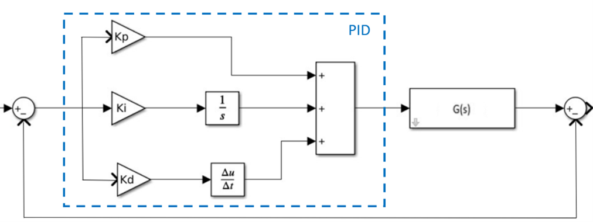
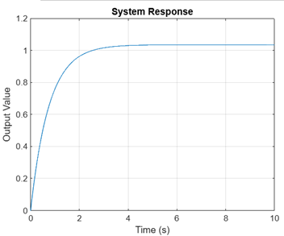
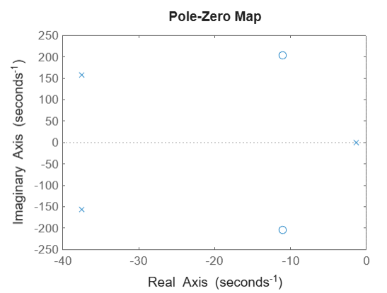
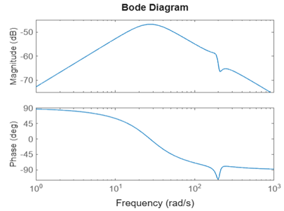

# eps-control-analysis-matlab-simulink
# Electric Power Steering (EPS) Control Analysis - MATLAB/Simulink

System-level modelling and closed-loop behaviour analysis of an **Electric Power Steering (EPS)** system using **MATLAB/Simulink**.  
Focus: implement a published EPS plant model, close the loop with PID, and evaluate behaviour against performance targets using stability and robustness checks.

## What I built
- Implemented an EPS plant model in **MATLAB/Simulink** (transfer-function-based) and integrated a **PID** controller in closed loop.
- Evaluated time-domain behaviour and extracted key KPIs:
  **overshoot**, **rise time**, **settling time**, **steady-state error**.
- Performed stability and frequency-domain sanity checks:
  **pole-zero map**, **Bode**, **Nyquist**.
- Ran a simple robustness disturbance injection test to observe recovery and settling behaviour.
- Documented modelling assumptions, limitations, and verification steps for traceability.

## Why this matters (systems / automotive relevance)
This is the kind of work that sits underneath ADAS and vehicle systems development:
- turning a model + requirements into a **closed-loop system**
- checking **expected vs actual** behaviour using measurable KPIs
- validating **stability / margins** before trusting results
- documenting assumptions so integration and reviews are repeatable

## Artifacts
- **Report (PDF):** `docs/EPS_Control_Analysis_Report.pdf`
- **Key figures:** `media/` (step response, pole-zero map, Bode/Nyquist, Simulink diagram)

## Selected results

<table>
  <tr>
    <td align="center">
       
      <b>Closed-loop Simulink model</b> EPS plant + PID controller
    </td>
    <td align="center">
       
      <b>Step response</b> Improved settling time & overshoot
    </td>
  </tr>
  <tr>
    <td align="center">
       
      <b>Pole–zero map</b> Closed-loop stability verification
    </td>
    <td align="center">
       
      <b>Frequency response</b> Bandwidth & disturbance rejection
    </td>
  </tr>
</table>

## Notes on scope
This repository is intentionally focused on **modelling + analysis + validation**.
It is not a production EPS controller or a high-fidelity vehicle dynamics model.

## References
The EPS plant model and baseline control approach are derived from published literature and reproduced in MATLAB/Simulink for analysis and verification (see PDF report for full details).
